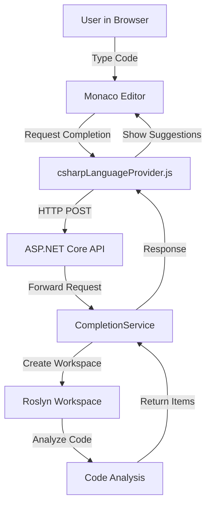

# Architecture

The MonacoRoslynCompletionProvider system consists of a frontend integration for the Monaco Editor and a backend service powered by Roslyn.

## High-Level Overview

## Backend (C#)

The backend is built with ASP.NET Core and uses Roslyn (Microsoft.CodeAnalysis) to analyze C# code.

*   **CompletionService**: The main entry point. It handles requests for completion, hover info, signature help, and code checking. It manages a cache of `CompletionWorkspace` instances.
*   **CompletionWorkspace**: Wraps a Roslyn `AdhocWorkspace`. It creates a temporary project and document for the code being analyzed. It loads necessary assemblies and metadata references.
*   **CompletionDocument**: Represents the document being analyzed. It exposes the Roslyn `Document`, `SemanticModel`, and `Diagnostics`.
*   **Providers**:
    *   `TabCompletionProvider`: Generates completion items (IntelliSense).
    *   `HoverInformationProvider`: Generates tooltips with type information and documentation.
    *   `SignatureHelpProvider`: Provides parameter info for methods.
    *   `CodeCheckProvider`: returns syntax and semantic errors.

## Frontend (JavaScript)

The frontend integration is provided by `csharpLanguageProvider.js`.

*   **registerCsharpProvider**: Registers the C# language providers with Monaco Editor.
*   **sendRequest**: Helper function to communicate with the backend API.
*   **CompletionItemProvider**: Maps Roslyn completion items to Monaco's `CompletionItem` format.
*   **HoverProvider**: Maps Roslyn hover info to Monaco's `Hover` format.
*   **SignatureHelpProvider**: Maps Roslyn signature help to Monaco's format.
*   **Code Validation**: Periodically sends code to the backend to check for errors and displays markers in the editor.
